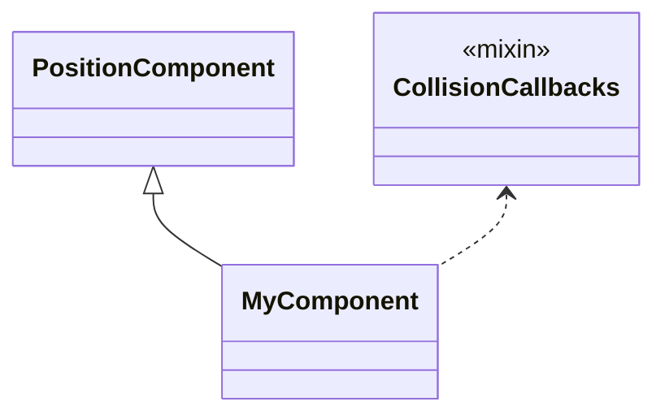
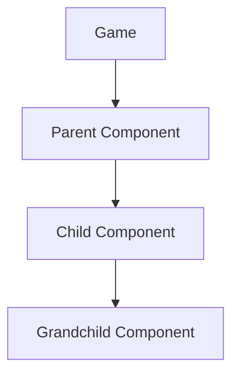
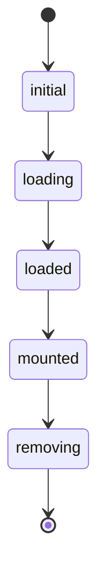
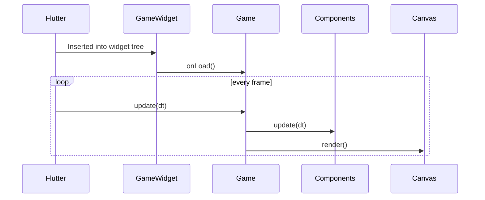

# Dart • Flutter • Flame — Summary

This document contains my findings from analyzing the pinball project made using Flutter and Flame Game

---

## Dart/Flame Keywords & Concepts

### `super`

* Equivalent to **`base` in C#**.
* Used to call parent class constructors or overridden method implementations.

```dart
@override
void onLoad() async {
  await super.onLoad();
}
```

---

### `required`

* For **named parameters**, forces the caller to provide a non-null argument.

```dart
void spawn({required Vector2 position}) { … }
```

---

### `@override`

* Indicates that a method from a superclass or mixin is overridden.

---

### `late` keyword

* Used for non-nullable fields that are initialized **after** construction
* Tells Dart: "Trust me, this will be initialized before first use"
* Common in Flame for loading assets in `onLoad()`
* **Runtime error** if accessed before initialization

```dart
class Player extends SpriteComponent {
  late Sprite idleSprite;
  late Sprite runSprite;

  @override
  Future<void> onLoad() async {
    idleSprite = await loadSprite('player_idle.png');
    runSprite = await loadSprite('player_run.png');
  }
}
```

---

### `Future<void>` / `async` / `await`

* Asynchronous computation. Comparable to `Task` in C#.

```dart
Future<void> loadAssets() async {
  final sprite = await images.load('player.png');
}
```

---

### `final` & `const`

| Keyword | Meaning                                       |
| ------- | --------------------------------------------- |
| `final` | Like **readonly**. Set once, at runtime.      |
| `const` | Compile-time constant. Similar to C# `const`. |

---

### `withParentIsA<T>`

* Allows a class to call parent properties
* Throws error on runtime if parent is of another type

---

### Mixins (`with`)

* Mixins add reusable behavior *with implementation*
* Similar to interfaces with default implementations in C# (but with actual implementation).

```dart
class MyComponent extends PositionComponent with CollisionCallbacks { … }
```

Visualization:



---

### Generics: `T2 extends T1`

* Same as inheritance constraints in C# generics.

---

### Library-private identifiers

* Prefix with `_` to make it **private to the file**.
* Good for helper classes/methods

```dart
class _InternalHelper { … }
```

---

## App Entry & Startup Flow

### Minimal Flame Game Entry

* Main master method that instantiates everything else

```dart
void main() {
  final game = MyGame();
  runApp(GameWidget(game: game));
}
```

* `runApp()` starts the Flutter widget tree.
* `GameWidget` hosts your Flame game canvas.
* When inserted into the widget tree, Flame starts the **update/render loop** automatically.

---

### Using a `StatelessWidget` wrapper

```dart
void main() => runApp(MyApp());

class MyApp extends StatelessWidget {
  @override
  Widget build(BuildContext context) {
    return MaterialApp(
      home: Scaffold(
        body: GameWidget(game: MyGame()),
      ),
    );
  }
}
```

#### Benefits of wrapping the game in Flutter widgets

* **MaterialApp:** Provides theme, localization, routes, navigator, debug/config options.
* **Adds standard page layout:** Scaffold gives appBar, FAB, drawers, snackbars, safe area handling. Useful for overlays/menus/HUD.
* **Overlays & Flutter UI:** You can easily add new widgets like buttons, score displays, pause menu above or beside the game using normal Flutter Widgets.
* **Dependency injection / providers:** Wrap GameWidget with InheritedWidgets/Providers (e.g. Provider, BlocProvider) to supply services to UI and game.
* **Navigation & multiple screens:** Host GameWidget as one route among many (menus, settings, multiple game modes).
* **Testing & composition:** easier to inject mocks, wrap with test widgets or compose other widgets for integration tests.
* **Input / focus control:** Wrapping lets controlling focus, system overlays and keyboard behaviour more reliably

#### When NOT needed

* Simple prototypes
* Quick engine tests with no UI

---

## Imports

```dart
import 'dart:async';                 
import 'package:flutter/widgets.dart';
import 'package:flame/components.dart';
```

---

## Classes, Inheritance & Mixins

### Class Definition

* **class MyComponent { }:** defines a class
* **extends ComponentToExtend:** Class from which new class will inherit
* **with MixinTypeName:** Mixin to add to the class so it can use its functionality

```dart
class MyComponent extends PositionComponent with HasGameRef<MyGame> {
  // ...
}
```

### Library Private Class

* Still can use “extends” and “with” keywords.
* Adding an underscore “_” at the start of the class name makes it library private.
* Useful for separating functionality into multiple different components, but keeping it private to the class using it.

```dart
class _MyComponent extends PositionComponent with HasGameRef<MyGame> {
  // ...
}
```

### Overriding Methods

* **@override:** indicates that method is getting overridden
* **Future<.void>:** Allows asynchronous operation of function, void is the return type here (nothing in this case).
* **async:** allows for await to be called, pauses the function until the Future completes.
* Useful for making sure certain code is run before other code is run.
* **super.funcName():** is used to call the base functionality of an inherited method, akin to base.FuncName() in C#.

```dart
@override
Future<void> onLoad() async {
  await super.onLoad();
  await loadSprites();
}
```

---

## Variables & Data Types

### Mutability

```dart
var x = 1;       // mutable
final y = 2;     // runtime constant
const z = 3;     // compile-time constant
static final pi = 3.14; // Static runtime constant shared by instances of classes.
```

### Collections

* **list:** Just like C# list. Needs datatype.
* **map:** Like a dictionary in C#

```dart
final list = <int>[1, 2, 3];
final map = {'a': 1, 'b': 2};
```

### Enums

* Just like C# enums.

```dart
enum FlipperState { movingUp, movingDown }
```

---

## Function Types & Typedefs

* Like a prefab for functions that enforces certain datatypes to be used.
* Function signature added to typedef with name NamedCb
* typedef implementation with name “f” uses NamedCb and takes over datatypes, then functionality is defined.
* "f" can now be called with the same parameters to print something

```dart
typedef NamedCb = void Function({required int x, String? tag});

NamedCb f = ({required x, tag}) => print('$x $tag');
```

---

## Getters & Setters

### Read-only Getter

* Adding **get** to a property makes it read-only
* Useful for computed properties or protecting internal state

```dart
class Rect {
  final double width, height;
  Rect(this.width, this.height);

  double get area => width * height;
}
```

### Custom Setter

* Adding **set** allows custom logic when assigning values
* Requires a private backing field to store the value
* Both getter and setter typically used together

```dart
class User {
  String _password = '';

  String get password => _password;
  set password(String value) {
    _password = value.hashCode.toString(); // Example: hash before storing
  }
}

// Usage
final user = User();
user.password = 'secret123';
print(user.password); // Prints hashed value
```

Custom setter:

* Adding set to a variable makes it only set a property.
* Property cannot be read.

```dart
set secret(String v) => _value = v;
```

---

## Constructors

* class defined without extension or mixins
* **Ball();** Basic form of the constructor
* **Required** keyword forces user to pass a certain variable into the constructor
* Named parameters use brackets **“{ }”** and are optional unless **required** is added

```dart
class Ball {
  Ball({required this.radius});
  final double radius;
}
```

---

## Functions & Parameters

### Required named parameters

* Function requires named property to be inputted
* Makes code more readable outside of function definition.
* Required for non nullable properties to avoid errors.

```dart
void spawn({required Vector2 pos});
spawn(pos: Vector2(10, 20));
```

### Regular parameters

* Function will require a certain input to be inputted
* Called as func(vectorPosition) or func(Vector2(x, y))

```dart
void spawn(Vector2 pos);
spawn(Vector2(10, 20));
```

### Optional positional

* String is optional
* Called as func(), func(stringVariable) or func(“string text”)

```dart
void log([String? message]);
```

### Null-safety

* **String? stringName:** nullable
* **maybe ??= ‘string’:** assigns value if null
* **final length = maybe?.length ?? 0:** If maybe exists, length is maybe.length, else it is 0. Same in C#

### Arrow Functions

* Shorthand syntax for functions with a single expression
* Uses `=>` operator (fat arrow)
* Automatically returns the expression result
* Commonly used for simple getters, callbacks, and one-liners

```dart
// Regular function
int double(int x) {
  return x * 2;
}

// Arrow function (equivalent)
int double(int x) => x * 2;

// Used in getters
double get area => width * height;

// Used in callbacks
final numbers = [1, 2, 3];
final doubled = numbers.map((n) => n * 2).toList();

// Multiple parameters
int add(int a, int b) => a + b;
```

**Note:** Arrow functions can only contain a **single expression**, not statements.

---

## Extension Methods

* **extension:** used to expand on functionality of a datatype, for example int
* Depending on the value of the int, the example always returns a bool

```dart
extension IntExt on int {
  bool get isEven => this % 2 == 0;
}

// Usage
5.isEven; // false
10.isEven; // true
```

---

## Cascade Operator (`..`)

* Allows calling multiple methods/setters on the same object without repeating the object reference
* Useful when configuring components
* Similar to C# object initializers

```dart
// Without cascade
final player = Player();
player.position = Vector2(10, 20);
player.size = Vector2(50, 50);
game.add(player);

// With cascade
game.add(
  Player()
    ..position = Vector2(10, 20)
    ..size = Vector2(50, 50)
);

// Multiple operations
game
  ..add(player)
  ..add(enemy)
  ..camera.viewport = FixedResolutionViewport(resolution: Vector2(800, 600));
```

**Note:** The cascade returns the original object, not the result of the method call.

---

## Flame Components & Lifecycle

### Component Tree Diagram



Flame updates & renders **hierarchically**.

---

### Key Component Methods

| Method               | Description                                        | C#/Unity equivalent                       |
| -------------------- | ---------------------------------------------------|-------------------------------------------|
| `onLoad()`           | Runs **once**, async constructor-like.             | OnStart/OnEnable                          |
| `onMount()`          | Runs when attached to parent.                      | OnStart but not a real equivalent         |
| `update(dt)`         | Called **every frame**.                            | Update()                                  |
| `updateTree(dt)`     | Advanced version of update. Usually not overriden  | None                                      |
| `render(canvas)`     | Called after updates of children finish.           | None                                      |
| `renderTree(dt)`     | Advanced version of render. Usually not overriden  | None                                      |
| `add()`              | Adds child component.                              | AddComponent()                            |
| `addToParent()`      | Adds child component.                              | AddComponent()                            |
| `remove()`           | Scheduled removal (next tick).                     | Destroy()                                 |
| `removeFromParent()` | Scheduled removal (next tick).                     | Destroy()                                 |
| `onGameResize()`     | Responds to window size changes.                   | None                                      |

---

### Component Lifecycle States



---

## Design Patterns

### Component / Composite Pattern

* Behaviour is expanded by adding components.
* General polymorphic components needed
* Behaviour is “Composed” by adding components

### Provider / Dependency Injection

* **FlameBlocProvider:** Constructs and supplies dependency (cubit) to descendant components and destroys it.
* **Cubit:** Emits state changes and children subscribe to these.
* Assigned state changes and many listeners can react asynchronously

### State Machine

* State enumerator + cubit manage state transitions
* Listening components process transitions between states

### Strategy Pattern

* Composition over inheritance
* Modular behaviours define parent functionality
* Allows for many different behaviours through composition

### Factory Method

* Property required by component, for example: Body & createBody() method.
* **createBody()** is overridden by specific implementations which allows for many different types of body configurations.

### Template Method

* Function is defined in a component and a child overrides it.
* For example: onLoad() is overridden to extend functionality.
* Inheriting components can hook into lifecycle events by overriding methods like this.

### Mixins/Trait-like composition

* Mixins define general behaviours/states which are injected into using classes without traditional inheritance
* Works like an interface in C#, but with an actual implementation that the using component can call, instead of needing a specific implementation.

### Adapter / Facade

* Provides a simpler/different interface over a lower level engine.

### Builder-like pattern (Object Configuration)

* Stepwise construction/configuration of complex objects.
* For example: Flipper body in object is constructed step by step by creating 2 circles of a different size, and then a trapezoid to bridge the gap between them.

---

## Unity → Flame Quick Conversion Table

| Unity          | Flame                                                  |
| -------------- | ------------------------------------------------------ |
| `Update()`     | `update(double dt)`                                    |
| `Start()`      | `onLoad()`                                             |
| GameObjects    | Components                                             |
| Transforms     | `position`, `size`, `angle`, `scale`                   |
| Coroutines     | `Future`, `async/await`, timers                        |
| Rigidbody2D    | Forge2D `Body`                                         |
| SpriteRenderer | `SpriteComponent`                                      |
| Scenes         | Different GameWidget screens                           |
| Input.GetKey   | Flutter `RawKeyboardListener` or Flame keyboard mixins |
| prefabs        | code-based factories                                   |

---

## Flame Game Loop Overview



---

## Recommended Mental Model (Unity → Flame)

* **FlameGame = Unity Scene**
* **Component = GameObject**
* **Mixins = Add-on behaviours**
* **onLoad() = Awake/Start**
* **update(dt) = Update()**
* **PositionComponent = Transform**
* **GameWidget = Camera/Viewport host**

---
